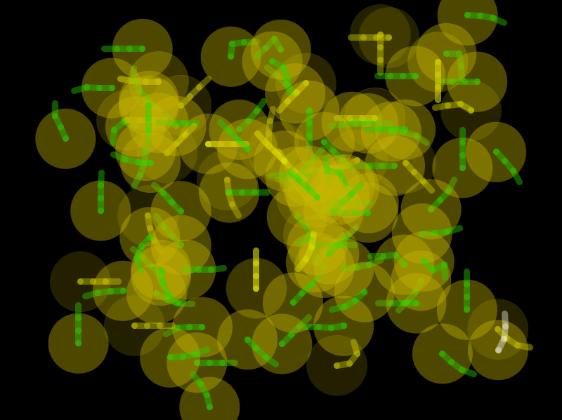

# Incubator
---
super alpha!  (work in progress!)

### what?
* Incubator is a generative audio sampler instrument that mutates sounds over time with a simulated population of sound-seeking and sound-making automata.

* Programmed with Processing.  View a video of it in action here:  https://vimeo.com/164755019

### what do I need?
* Most any modern computer with a built-in soundcard, microphone, and speakers.

* Processing: https://processing.org/download/?processing

* The Minim library for Processing (see setup instructions below)

### SETUP INSTRUCTIONS:
  1. Launch the Processing IDE and open 'Incubator.pde'
  2. Install the Minim library to run the sketch:
      a. Within the Processing IDE navigate to: Sketch > Import Library > Add Library
      b. Within the 'Libraries' tab, type "Minim" into the search bar
      c. Select the Minim library and click "Install"
  3. Press "Play" to launch the simulation
  
  NOTE: this sketch records audio from your system's default audio input (e.g. your laptop's internal soundcard) and writes audio files to the main folder of this sketch
  
### OPERATING INSTRUCTIONS:
  • Click the screen to create a sound input node. Sing, yell, whistle, etc. into your microphone input to attract the serpents to the virtual sound source.
      Note: The loudness of your sound-making determines the range (diameter) of the virtual sound source node. Louder sounds will more likely attract serpents from farther away.
            The yellow circle surrounding a serprent's head represents its sensory and vocalization range. Serpents can only perceive sound input and other serpent vocalizations that overlap with their sensory range.
  • When a serpent is w/in range of the sound input node, it will hear your sound and move to be within close proximity of the sound input node.
  • Once the serpent is situated within optimal range of the sound input node, it will start glowing red and recording your audio input for a short duration.
  • After the serpent has completed recording your audio input, it will change color and continue to sit and listen as long as the sound source persists.
  • Sound input nodes will fade and disappear over time if medium to loud sounds aren't detected by your system's audio input.
  • Alternatively, clicking on an existing sound input node will delete it. (Note: Currently, only one sound input node node can be active at a time.)
  • Press any key to generate additional serpents up to the maximum limit as specified by the value of the 'maxSerpentNum' variable below.
  • Once at least one serpent has recorded a sound, the simulation will be able to proceed under its own operation as the autonomous agents vocalize and interact with each other through sound.
       - Each time a serpent hears another serpent's vocalization, there's a chance that its own sound-making parameters (currentl playback rate (pitch) and sample duration) will interpolate towards that of the vocalizing serpent's parameter values
         OR the listening serpent's source sample will change to match the vocalizing serpent's.
       - Through this mechanism, sounds are transmitted through the population and mutate over time.
       - Input new sounds to hear how they evolve through the population over time.
  • After you're done running this sketch, a number of audio files may have been saved within your sketch folder (at least one per each unique sound source input node recorded by a serpent).
      If you'd like to save the audio files generated by the sketch, retitle them or move them to a different location on your computer, otherwise they may be overwritten upon subsequent operations of this sketch.
      
---
This is a work in progress.  Feel free to use, experiment, and contribute.

If you're using this for any of your own projects, I'd love to hear about it! => scott(dot)tooby(at)gmail(dot)com

st, 2016